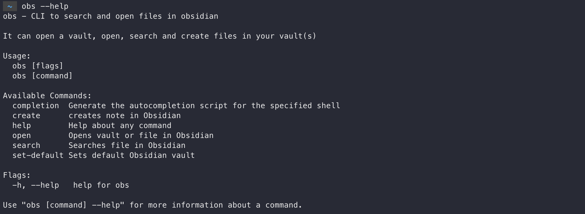

# Obsidian CLI Tool



CLI made to search, open and creates notes in Obsidian. Written in [Go](https://go.dev/), built on top of existing [Obsidian URIs](https://help.obsidian.md/Advanced+topics/Using+obsidian+URI)

## Description

[Obsidian](https://obsidian.md/) is a powerful and extensible knowledge base application
that works on top of your local folder of plain text notes. This CLI tool will let you interact with the application using the terminal. You are currently able to open, search and create notes.

## Install

### Homebrew

```Bash
brew tap yakitrak/yakitrak
```

```Bash
brew install yakitrak/yakitrak/obs
```

### Manual

1. Download the file from https://github.com/Yakitrak/obsidian-cli/releases
2. Set it to path:

- Mac: `sudo cp {name-of-file} /usr/local/bin/obs`
- Linux: `sudo cp {name-of-file} /usr/local/bin/obs`
- Windows: Set `{name-of-file}.exe` to path using [this](https://www.architectryan.com/2018/03/17/add-to-the-path-on-windows-10/)

## Usage

### Help

```bash
# See All command instructions
obs --help
```

### Set Default Vault

Defines default vault for future usage. If not set, pass `--vault` flag for other commands

```bash
obs set-default "{vault-name}"
```

### Open Note

Open given note name in Obsidian. Note can also be a path from root of vault.

```bash
# Opens note in obsidian
obs open "{note-name}"

# Opens note in specified vault
obs open "{note-name}" --vault "{vault-name}"

```

### Search Note

Opens obsidian search tab with given search text

```bash
# Searches in default vault
obs search "{search-text}"

# Searches in specified vault
obs search "{search-text}" --vault "{vault-name}"

```

### Create / Update Note

Creates note (can also be a path with name) in vault. By default if the note exists, it will create another note but passing `--overwrite` or `--append` can be used to edit the named note.

```bash
# Creates empty note in default vault and opens it
obs create "{note-name}"

# Creates empty note in given vault and opens it
obs create "{note-name}"  --vault "{vault-name}"

# Creates note in default vault with content
obs create "{note-name}" --content "abcde"

# Creates note in default vault with content - overwrite existing note
obs create "{note-name}" --content "abcde" --overwrite

# Creates note in default vault with content - append existing note
obs create "{note-name}" --content "abcde" --append

```

### Rename Note

Renames a given note(path from vault root) with new name given (path from vault root) . All links inside vault are updated to match new name.

```bash
# Renames a note in default vault
obs rename "{current-note-path}" "{new-note-path}"

# Renames a note and given vault
obs rename "{current-note-path}" "{new-note-path}" --vault "{vault-name}"

# Renames a note in default vault and opens it
obs rename "{current-note-path}" "{new-note-path}" --open
```
